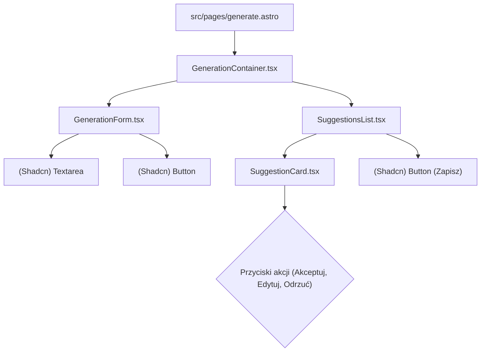

# Plan implementacji widoku generowania fiszek

## 1. Przegląd

Widok generowania fiszek to kluczowy interfejs dla zalogowanego użytkownika, umożliwiający transformację dowolnego tekstu w zestaw propozycji fiszek przy użyciu AI. Użytkownik może wkleić tekst, zainicjować proces generowania, a następnie przeglądać, edytować, akceptować lub odrzucać otrzymane sugestie. Celem widoku jest zautomatyzowanie i znaczne przyspieszenie procesu tworzenia materiałów do nauki.

## 2. Routing widoku

Widok będzie dostępny pod następującą ścieżką dla zalogowanych użytkowników:

- **Ścieżka**: `/generate`

## 3. Struktura komponentów

Komponenty zostaną zaimplementowane w React z użyciem TypeScript, Tailwind CSS i komponentów UI z biblioteki Shadcn. Główny komponent widoku będzie renderowany po stronie klienta wewnątrz strony Astro.



## 4. Szczegóły komponentów

### `GenerationContainer.tsx`

- **Opis komponentu**: Główny, stanowy komponent-kontener, który orkiestruje całym procesem generowania. Wykorzystuje customowy hook `useGenerationManager` do zarządzania stanem, logiką biznesową i komunikacją z API. Renderuje formularz oraz listę sugestii (lub stany ładowania/błędu).
- **Główne elementy**:
  - Komponent `GenerationForm`.
  - Komponent `SuggestionsList`.
  - Logika warunkowego renderowania dla stanów: `loading` (np. komponenty `Skeleton` z Shadcn), `error` (komponent `Alert` z Shadcn) i `success` (lista sugestii).
- **Obsługiwane interakcje**: Brak bezpośrednich. Komponent deleguje obsługę zdarzeń do swoich dzieci, przekazując im funkcje z hooka `useGenerationManager`.
- **Typy**: `SuggestionViewModel`, `ApiState`.
- **Propsy**: Brak.

### `GenerationForm.tsx`

- **Opis komponentu**: Komponent prezentacyjny, odpowiedzialny za interfejs do wprowadzania tekstu źródłowego. Zawiera pole tekstowe, licznik znaków oraz przycisk inicjujący generowanie.
- **Główne elementy**:
  - `Textarea` (z Shadcn) na tekst źródłowy.
  - Licznik znaków wyświetlający `text.length / 10000`.
  - Komunikat walidacyjny wyświetlany pod polem tekstowym.
  - `Button` (z Shadcn) z napisem "Generuj fiszki".
- **Obsługiwane interakcje**:
  - `onChange` na polu `Textarea`: aktualizuje stan tekstu źródłowego.
  - `onSubmit` na formularzu lub `onClick` na przycisku: wywołuje funkcję generowania propozycji.
- **Obsługiwana walidacja**:
  - Długość tekstu źródłowego musi mieścić się w przedziale `1000 <= length <= 10000`.
  - Przycisk "Generuj fiszki" jest nieaktywny (`disabled`), jeśli warunek długości nie jest spełniony lub gdy trwa proces generowania (`isLoading`).
- **Typy**: Brak specyficznych.
- **Propsy**:
  - `sourceText: string`
  - `onTextChange: (text: string) => void`
  - `onSubmit: () => void`
  - `isLoading: boolean`
  - `validationError: string | null`

### `SuggestionsList.tsx`

- **Opis komponentu**: Komponent odpowiedzialny za renderowanie listy wygenerowanych sugestii fiszek (`SuggestionCard`) oraz przycisku do zapisywania zaakceptowanych kart.
- **Główne elementy**:
  - Nagłówek informujący o liczbie sugestii.
  - Lista komponentów `SuggestionCard` renderowana za pomocą metody `.map()`.
  - `Button` (z Shadcn) "Zapisz zaakceptowane fiszki".
- **Obsługiwane interakcje**:
  - Akcje na poszczególnych kartach (delegowane do `SuggestionCard`).
  - `onClick` na przycisku "Zapisz": wywołuje funkcję zapisu wsadowego wybranych fiszek.
- **Obsługiwana walidacja**:
  - Przycisk "Zapisz" jest nieaktywny, jeśli żadna karta nie ma statusu `accepted` lub `edited`.
- **Typy**: `SuggestionViewModel`.
- **Propsy**:
  - `suggestions: SuggestionViewModel[]`
  - `onUpdateSuggestion: (id: string, data: Partial<SuggestionViewModel>) => void`
  - `onSaveBatch: () => void`
  - `isSaving: boolean`

### `SuggestionCard.tsx`

- **Opis komponentu**: Komponent prezentujący pojedynczą sugestię fiszki. Umożliwia jej edycję w miejscu oraz zmianę jej statusu (akceptacja, odrzucenie).
- **Główne elementy**:
  - Dwa bloki tekstu dla `front` i `back`.
  - Kontener z przyciskami akcji: `Button` "Akceptuj", "Edytuj", "Odrzuć".
  - W trybie edycji: dwa pola `Textarea` i przyciski "Zapisz zmiany", "Anuluj".
  - Wizualny wskaźnik statusu (np. kolor ramki, ikona).
- **Obsługiwane interakcje**:
  - `onClick` na przyciskach akcji: wywołuje odpowiednie funkcje przekazane w `props`, zmieniając status karty.
  - `onClick` na "Edytuj": przełącza kartę w tryb edycji.
  - `onClick` na "Zapisz zmiany": wywołuje funkcję aktualizacji treści karty i przełącza ją z powrotem do trybu wyświetlania.
- **Typy**: `SuggestionViewModel`.
- **Propsy**:
  - `suggestion: SuggestionViewModel`
  - `onUpdate: (id: string, data: Partial<SuggestionViewModel>) => void`

## 5. Typy

Do implementacji widoku, oprócz typów DTO z `src/types.ts`, wymagany będzie niestandardowy typ ViewModel do zarządzania stanem UI.

```typescript
// Plik: src/components/features/generation/types.ts

import type { FlashcardSuggestionDto } from "../../../types";

/**
 * Status sugestii fiszki w interfejsie użytkownika.
 * - 'new':      Świeżo wygenerowana, bez interakcji użytkownika.
 * - 'accepted': Zaakceptowana przez użytkownika bez zmian.
 * - 'edited':   Zaakceptowana przez użytkownika po dokonaniu zmian.
 * - 'rejected': Odrzucona przez użytkownika.
 */
export type SuggestionStatus = "new" | "accepted" | "edited" | "rejected";

/**
 * ViewModel dla pojedynczej sugestii fiszki.
 * Rozszerza DTO o pola potrzebne do śledzenia stanu w UI.
 */
export interface SuggestionViewModel extends FlashcardSuggestionDto {
  /** Unikalny identyfikator po stronie klienta (np. z crypto.randomUUID()) */
  id: string;
  /** Aktualny status karty w cyklu życia interakcji użytkownika */
  status: SuggestionStatus;
}

/**
 * Typ określający stan komunikacji z API.
 */
export type ApiState = "idle" | "loading" | "success" | "error";
```

## 6. Zarządzanie stanem

Cała logika stanu zostanie zamknięta w customowym hooku `useGenerationManager`, co zapewni separację logiki od prezentacji i ułatwi testowanie.

**`useGenerationManager.ts`**

- **Cel**: Zarządzanie stanem `sourceText`, listą `suggestions`, stanem API (`apiState`) oraz obsługa błędów.
- **Struktura (uproszczona)**:

  ```typescript
  function useGenerationManager() {
    const [sourceText, setSourceText] = useState("");
    const [suggestions, setSuggestions] = useState<SuggestionViewModel[]>([]);
    const [apiState, setApiState] = useState<ApiState>("idle");
    const [errorMessage, setErrorMessage] = useState<string | null>(null);
    const [generationId, setGenerationId] = useState<string | null>(null);

    const handleGenerate = useCallback(async () => {
      /* ... logika fetch ... */
    });
    const handleUpdateSuggestion = useCallback((id, data) => {
      /* ... logika aktualizacji listy ... */
    });
    // ... inne handlery

    return {
      sourceText,
      setSourceText,
      suggestions,
      apiState,
      errorMessage,
      handleGenerate,
      handleUpdateSuggestion,
      // ...
    };
  }
  ```

- Hook ten będzie prawdopodobnie używał `useReducer` do zarządzania złożonymi zmianami na liście sugestii, co uprości logikę aktualizacji.

## 7. Integracja API

Integracja opiera się na jednym punkcie końcowym API.

- **Endpoint**: `POST /api/generations`
- **Akcja**: Inicjowana przez kliknięcie przycisku "Generuj fiszki".
- **Żądanie (Request)**:
  - **Typ**: `CreateGenerationCommand` (`{ sourceText: string }`)
  - **Przykład**:
    ```json
    {
      "sourceText": "Astro to nowoczesny framework webowy..."
    }
    ```
- **Odpowiedź (Response)**:
  - **Typ**: `GenerationSuggestionsResponseDto`
  - **Przykład**:
    ```json
    {
      "generationId": "a1b2c3d4-...",
      "flashcardsSuggestions": [
        { "front": "Czym jest Astro?", "back": "Nowoczesnym frameworkiem webowym.", "source": "ai-full" }
      ],
      "generationCount": 1
    }
    ```
- Hook `useGenerationManager` będzie odpowiedzialny za wykonanie wywołania `fetch`, obsługę odpowiedzi i zmapowanie `flashcardsSuggestions` na listę `SuggestionViewModel[]`.

## 8. Interakcje użytkownika

1.  **Wprowadzanie tekstu**: Użytkownik wpisuje lub wkleja tekst. Interfejs na bieżąco wyświetla licznik znaków i stan walidacji.
2.  **Generowanie**: Użytkownik klika "Generuj fiszki". Przycisk staje się nieaktywny, a w miejscu listy sugestii pojawiają się skeletony.
3.  **Przeglądanie**: Po pomyślnym wygenerowaniu, na ekranie pojawia się lista sugestii.
4.  **Akcje na karcie**:
    - **Akceptuj**: Karta zmienia styl (np. zielona ramka), a przycisk "Zapisz" może stać się aktywny.
    - **Odrzuć**: Karta zmienia styl (np. zostaje wyszarzona).
    - **Edytuj**: Karta przechodzi w tryb edycji z polami tekstowymi. Po zapisaniu zmian, karta otrzymuje status `edited`.
5.  **Zapis wsadowy**: Użytkownik klika "Zapisz zaakceptowane fiszki", co inicjuje wysłanie przetworzonych danych do API (poza zakresem tego planu).

## 9. Warunki i walidacja

- **Komponent**: `GenerationForm.tsx`
- **Warunek**: Długość `sourceText` musi spełniać `1000 <= length <= 10000`.
- **Logika walidacji**: Funkcja pomocnicza `isSourceTextValid(text: string)` będzie sprawdzać ten warunek.
- **Wpływ na UI**:
  - Przycisk "Generuj fiszki" ma atrybut `disabled` ustawiony na `!isSourceTextValid(sourceText) || apiState === 'loading'`.
  - Pod `Textarea` wyświetlany jest komunikat o błędzie (np. "Tekst musi mieć od 1000 do 10000 znaków."), jeśli pole straciło fokus, a jego zawartość jest nieprawidłowa.

## 10. Obsługa błędów

- **Błąd walidacji po stronie klienta**: Obsługiwany w komponencie `GenerationForm` przez wyświetlenie komunikatu walidacyjnego, jak opisano powyżej.
- **Błąd API (np. 4xx, 5xx, błąd sieci)**:
  1. Hook `useGenerationManager` przechwytuje błąd w bloku `catch` wywołania `fetch`.
  2. Stan `apiState` jest ustawiany na `'error'`.
  3. Stan `errorMessage` jest aktualizowany o treść błędu zwróconą z API lub o generyczny komunikat.
  4. Komponent `GenerationContainer` na podstawie stanu `apiState === 'error'` renderuje komponent `Alert` (z Shadcn), wyświetlając użytkownikowi stosowny komunikat (np. "Wystąpił błąd podczas generowania fiszek. Spróbuj ponownie.").

## 11. Kroki implementacji

1.  **Stworzenie struktury plików**:
    - Utwórz plik strony `src/pages/generate.astro`.
    - Utwórz katalog `src/components/features/generation`.
    - Wewnątrz niego stwórz pliki: `GenerationContainer.tsx`, `GenerationForm.tsx`, `SuggestionsList.tsx`, `SuggestionCard.tsx`, `useGenerationManager.ts` i `types.ts`.
2.  **Implementacja strony Astro**: W `generate.astro` zaimportuj i wyrenderuj `GenerationContainer.tsx` ze znacznikiem `client:load`.
3.  **Zdefiniowanie typów**: Wypełnij plik `types.ts` definicjami `SuggestionStatus` i `SuggestionViewModel`.
4.  **Implementacja hooka `useGenerationManager`**: Zaimplementuj podstawową logikę stanu (`useState` dla `sourceText`, `apiState` itd.).
5.  **Implementacja komponentu `GenerationForm`**: Zbuduj formularz z użyciem komponentów Shadcn, przekaż `propsy` i zaimplementuj logikę walidacji oraz stanu `disabled` przycisku.
6.  **Integracja API w hooku**: Zaimplementuj funkcję `handleGenerate` w hooku, która wykonuje `fetch` do `POST /api/generations`, obsługuje sukces i błąd, oraz aktualizuje stany.
7.  **Implementacja komponentów `SuggestionsList` i `SuggestionCard`**:
    - Zbuduj komponent `SuggestionCard` do wyświetlania danych jednej fiszki.
    - Zaimplementuj `SuggestionsList` do renderowania listy kart.
    - Dodaj logikę warunkowego renderowania w `GenerationContainer` (ładowanie, błąd, sukces).
8.  **Implementacja akcji na kartach**:
    - Rozbuduj hook `useGenerationManager` o funkcje do aktualizacji statusu kart (np. `handleUpdateSuggestion`).
    - Zaimplementuj obsługę przycisków "Akceptuj" i "Odrzuć" w `SuggestionCard`.
9.  **Implementacja edycji w miejscu**: Dodaj lokalny stan `isEditing` do `SuggestionCard` i zaimplementuj logikę przełączania między trybem wyświetlania a edycji.
10. **Finalizacja i stylowanie**: Dopracuj wygląd, responsywność i stany wizualne (np. `hover`, `focus`, kolory statusów) zgodnie z systemem designu opartym na Tailwind i Shadcn.
